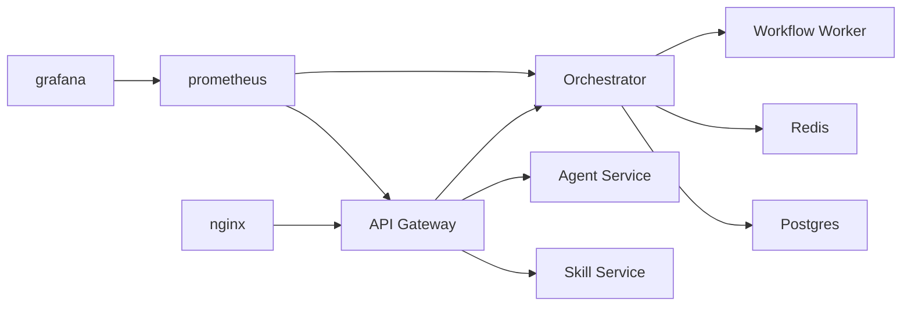

## Architecture Overview

High-level components:

- `nginx` — edge reverse proxy (infra/nginx). Handles routing to `/api/` and static responses.
- `api-gateway` — central API gateway that forwards requests to backend services and provides diagnostics and audit endpoints.
- Service mesh:
  - `skill-service`
  - `agent-service`
  - `policy-service`
  - `memory-service`
  - `orchestrator-service` (+ `workflow-worker`)
- Persistence:
  - `postgres` (primary database)
  - `redis` (queue, pub/sub, short-term state)
- Observability:
  - `prometheus` for metrics
  - `grafana` for dashboards

Mermaid diagram (scaffold):

